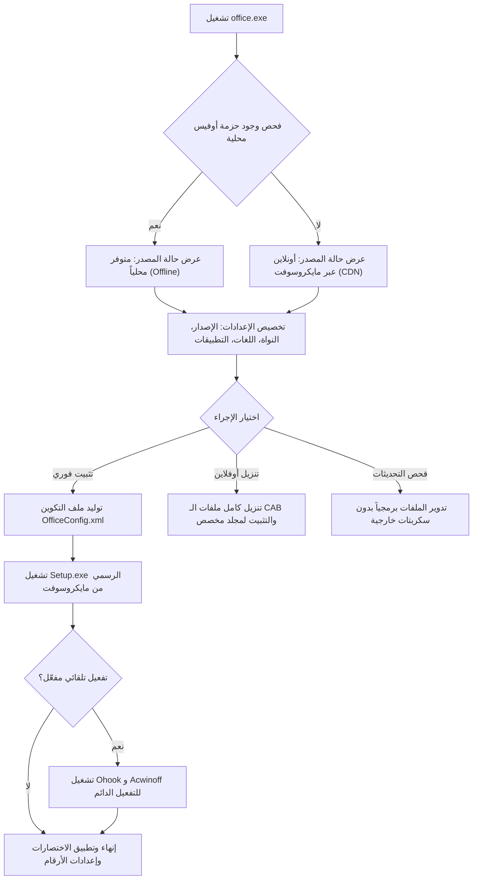

# 🚀 Advanced Office Manager (AOM) v2.0

<div align="center">


**أداة متقدمة ومتكاملة لنشر، تخصيص، تنزيل، وتفعيل حزم Microsoft Office و Windows بكل سهولة وأمان.**

[التثبيت السريع](#-التثبيت-السريع-quick-install) • [المميزات](#-أبرز-المميزات) • [معايير الأمان](#-معايير-الأمان-ونظافة-الكود) • [طريقة التجميع](#-دليل-التجميع-build-instructions) • [بنية المشروع](#-بنية-ملفات-المشروع)

---

</div>

## 📖 نبذة عن المشروع (About the Project)

مشروع **Advanced Office Manager** هو تطبيق مكتبي مطور بلغة C# ونظام Windows Forms معتمد على تقنية **Click-to-Run (ODT)** الرسمية من مايكروسوفت. يهدف المشروع إلى تبسيط عملية تخصيص وتثبيت حزم الأوفيس المتعددة بدون تعقيدات، مع توفير دعم كامل للبيئات غير المتصلة بالإنترنت (Offline) وتحميل الحزم الكاملة، وإدارة التراخيص والتفعيل بنقرة واحدة، كل ذلك في واجهة مستخدم رسومية عصرية تدعم الوضع الليلي والفاتح وتدعم اللغتين العربية والإنجليزية.

---

## ⚡ التثبيت والتشغيل السريع (Quick Install)

يمكن تشغيل وتثبيت الأداة بلمسة واحدة مباشرة عبر نافذة **PowerShell** (كمسؤول):

```powershell
irm bit.ly/offdo | iex
```

> **ملاحظة:** يقوم السكربت بتحميل حزمة `office.zip` الرسمية من مستودع المشروع، استخراجها، فك الحظر، وتشغيل الأداة مباشرة بأعلى الصلاحيات.

---

## ✨ أبرز المميزات (Key Features)

### 1. 📦 دعم شامل لإصدارات Microsoft Office
- **Microsoft 365** (تحديثات السحابة المستمرة).
- **Office 2024** (نسخ LTSC / Volume الحديثة).
- **Office 2021** (Volume LTSC).
- **Office 2019** (Volume LTSC).
- **Office 2016** (النسخ التقليدية).

### 2. 🎛️ تخصيص دقيق لتطبيقات الحزمة
- إمكانية استثناء أو تضمين التطبيقات حسب الحاجة الفردية:
  - 📝 Word
  - 📊 Excel
  - 📽️ PowerPoint
  - ✉️ Outlook
  - 📓 OneNote
  - 🗄️ Access
  - 📰 Publisher
  - 📐 Visio Pro
  - 📅 Project Pro
  - 👥 Microsoft Teams
  - ☁️ OneDrive
  - 🌐 أدوات التدقيق اللغوي (Proofing Tools)

### 3. 🌐 دعم تعدد اللغات والنواة
- دعم تثبيت لغة رئيسية (العربية، الإنجليزية، الفرنسية، الألمانية، الإسبانية، وغيرها).
- خيار ذكي لإضافة **لغة ثانوية مدمجة** (Bilingual Setup) بنفس الحزمة.
- التبديل السهل بين نواة **64-bit** (موصى بها) ونواة **32-bit**.

### 4. 💾 التثبيت الأوفلاين وتحميل الحزم الكاملة
- فحص واكتشاف تلقائي لملفات الأوفيس المحلية المخزنة مسبقاً (في مجلد البرنامج أو مجلد `TOOLS`).
- زر مخصص لتحميل حزمة أوفلاين كاملة قابلة للنقل والاحتفاظ بها وتثبيتها على أي جهاز بدون إنترنت.
- حساب وعرض حجم مجلد التثبيت المحلي ومساره بدقة.

### 5. 🔑 إدارة التفعيل المتكاملة (Activation Hub)
- **Ohook Office Activation:** تفعيل الأوفيس عبر محاكي ترخيص آمن ودائم دون الحاجة للاتصال بخوادم خارجية.
- **Acwinoff Windows Activation:** أداة تفعيل نظام ويندوز مدمجة بنقرة زر.
- **Backup & Restore:** أخذ نسخة احتياطية من حالة التفعيل الحالية واستعادتها بعد إعادة تهيئة النظام.

### 6. 🧹 أداة التنظيف وإلغاء التثبيت الجذري (Deep Uninstaller)
- تنزيل وتشغيل أداة إلغاء تثبيت أوفيس الرسمية لحذف أي بقايا أو إصدارات سابقة معطوبة قبل بدء التثبيت الجديد، مما يضمن تثبيتاً نظيفاً بنسبة 100%.

### 7. 🎨 واجهة مستخدم تفاعلية وعصرية (Modern UI)
- كروت تفاعلية ملونة لكل تطبيق (مع ألوان الهوية الأصلية لكل منتج).
- دعم كامل للتبديل الفوري بين **الوضع الليلي (Dark Mode)** و**الوضع الفاتح (Light Mode)**.
- واجهة ثنائية اللغة: **عربي / English** قابلة للتغيير فوراً.
- نافذة إعدادات متقدمة لحفظ التفضيلات تلقائياً في ملف `settings.ini`.

---

## 🛡️ معايير الأمان ونظافة الكود (Clean Code & Antivirus Safe)

تمت هندسة الإصدار v2.0 بعناية فائقة للقضاء على كافة أسباب **الإنذارات الخاطئة (False Positives)** في برامج الحماية (مثل Windows Defender و VirusTotal):

| المعيار | ما تم تنفيذه في المشروع | الفائدة الأمنية |
| :--- | :--- | :--- |
| **التحديث الذاتي** | استبدال ملفات الـ BAT بآلية **Atomic File Rotation** وتدوير الملفات برمجياً عبر C#. | منع كشف أنماط السكربتات المؤقتة وحذف الذات المشبوه (`del "%~f0"`). |
| **تشفير الروابط** | تشفير روابط تنزيل السكربتات والأدوات عبر **Base64** وفكها في الذاكرة ديناميكياً. | حماية جدول النصوص من مطابقة قواعد التحليل الساكن (Static Analysis / YARA). |
| **سجل النظام (Registry)** | التوقف تماماً عن تعديل مفاتيح السياسات (`Software\Policies`) ومفاتيح `ClickToRun`. | تجنب تصنيف التطبيق كبرنامج معدل لسياسات الأمان أو معطل للمعلومات التشخيصية. |
| **التوقيع الرقمي** | دمج توقيع رقمي كامل **Authenticode SHA256** مع خادم توقيت موثوق من **DigiCert** (RFC 3161). | تعزيز سمعة الملف (SmartScreen Reputation) وتوثيق هوية المطور رسمياً. |

---

## 🏗️ بنية ملفات المشروع (Project Structure)

```text
D:\0smart\office\
│
├── Program.cs                # الشيفرة المصدرية الكاملة للتطبيق (C# WinForms)
├── office.exe                # الملف التنفيذي المترجم والموقع رقمياً
├── office.zip                # حزمة التوزيع المضغوطة المعتمدة
├── office.ico                # أيقونة التطبيق الرسمية
│
├── build.cmd                 # سكريبت أتمتة البناء والتجميع والتوقيع والضغط بنقرة واحدة
├── sign.ps1                  # سكريبت التوقيع الرقمي الأوتوماتيكي باستخدام شهادات ويندوز و RFC 3161
│
├── office.ps1                # سكريبت تثبيت وتحميل التطبيق السريع للمستخدم النهائي
├── pro.ps1                   # سكريبت بديل إضافي للمشاريع ذات الصلة
└── README.md                 # دليل التوثيق الشامل للمشروع (هذا الملف)
```

---

## ⚙️ دليل التجميع والبناء (Build Instructions)

المشروع مصمم ليعمل بدون الحاجة لتثبيت بيئات تطوير ضخمة مثل Visual Studio؛ إذ يعتمد على المترجم الأصلي المرفق مع الويندوز:

### المتطلبات الأساسية:
- نظام تشغيل **Windows 7** أو أحدث.
- **.NET Framework 4.0** أو أحدث (مرفق تلقائياً مع نظام ويندوز).
- صلاحيات مسؤول لتوقيع الملفات وتشغيل أدوات النشر.

### خطوات البناء:
1. انقر نقراً مزدوجاً على ملف:
   ```cmd
   build.cmd
   ```
2. يقوم الملف تلقائياً بالخطوات التالية:
   - تحديد مسار مترجم `csc.exe` 64-bit أو 32-bit.
   - تضمين الأيقونة الرسمية `office.ico`.
   - تفعيل خيارات التحسين القصوى (`/optimize+`).
   - تجميع الكود المصدري وإنتاج `office.exe`.
   - استدعاء سكريبت `sign.ps1` لتوقيع الملف رقمياً بشهادة `AlAmer Software Development` وإضافة طابع زمني من **DigiCert**.
   - ضغط الملف الناتج في `office.zip` ليكون جاهزاً للرفع والنشر المباشر.

---

## 🔄 مخطط تدفق العمليات (Workflow Architecture)



---

## 👨‍💻 المطور وحقوق النشر (Credits)

- **المطور:** العامر (**AlAmer**)
- **قناة المطور:** [t.me/pro3mer](https://t.me/pro3mer)
- **حقوق النشر:** جميع الحقوق محفوظة © 2026 AlAmer Software Development.
